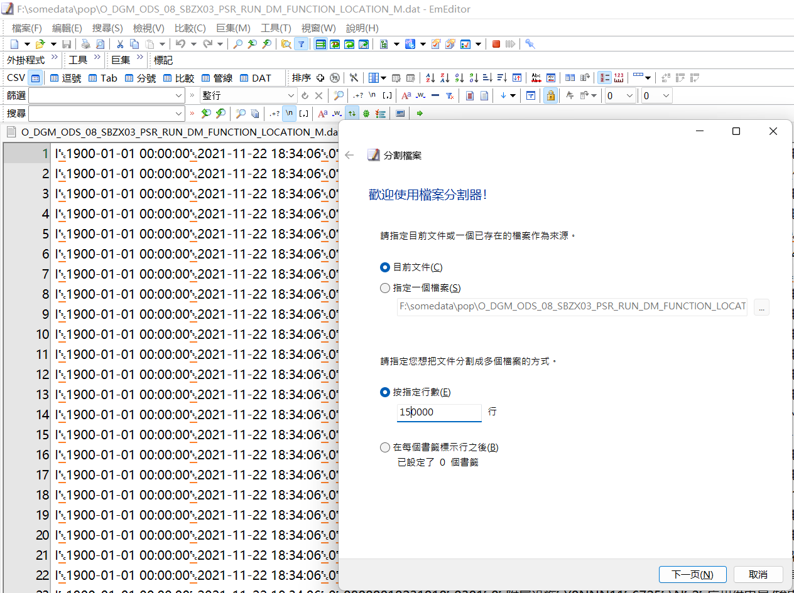
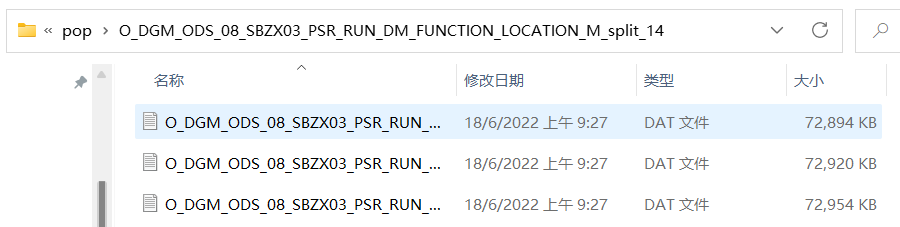
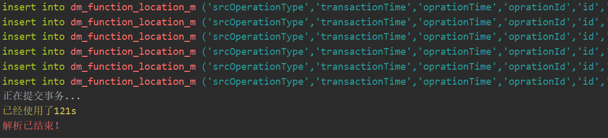
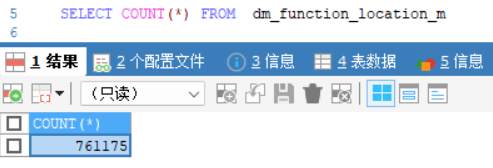

# 快速解析大数据文件入库脚本

## 例子

``` java
  @SneakyThrows
    public static void main(String[] args) {

        BaseConnector connector = new BaseConnector("127.0.0.1", "3306", "pool", "root", "1223456");

        String dir = "F:\\somedata\\pool\\O_DGM_ODS_08_SBZX03_PSR_RUN_DM_FUNCTION_LOCATION_M_split_6"; //数据文件块存储路径

        String suffix = "dat"; //数据文件后缀名

        Class<?> clazz = DmFunctionLocationM.class; //转化的模型对象

        BatchWriter batch = new BatchWriter(connector, dir, suffix, clazz); 

        batch.invoke();
    }
```

## 过程

- 如果文件过大，直接读取会发生内存溢出问题，可用EmEditor按行分割文件



- 分割的文件目录



- 程序会迭代该目录所有文件进行解析，解析完成后提交事务



- 数据入库成功


